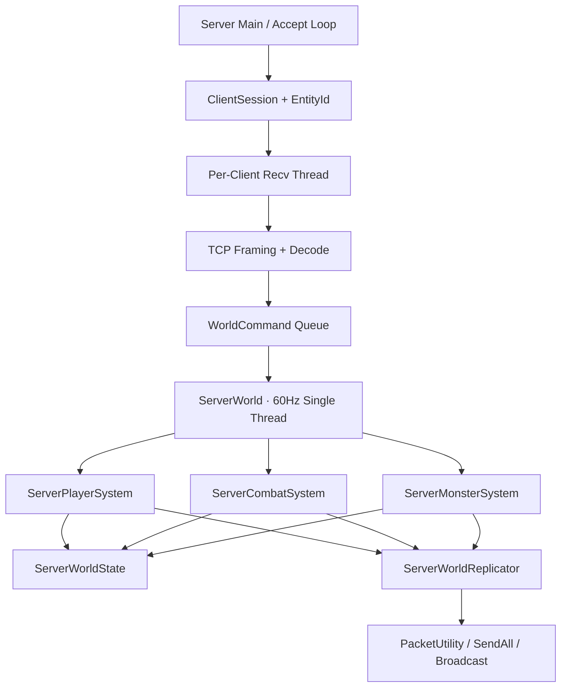

# GameServer — Dedicated Server Map

`GameServer`는 WinSock2 TCP 기반 Dedicated Server입니다.  
각 Client의 수신 Thread는 Byte Stream을 Packet과 `WorldCommand`로 변환하고, 실제 World 상태는 60Hz 단일 Thread가 순서대로 변경합니다.

[전체 Reviewer Guide로 이동](../docs/REVIEW_GUIDE.md) · [Client 보기](../MyEngine_W/README.md) · [Protocol 보기](../MyEngine_Source/Protocol.h)

## 가장 먼저 볼 파일

| 순서 | 파일 | 확인할 내용 |
|---:|---|---|
| 1 | [`main.cpp`](./main.cpp) | Accept Loop, Session, Per-Client Recv Thread, TCP Framing |
| 2 | [`ServerWorld.cpp`](./ServerWorld.cpp) | Command Queue 소비와 Fixed Tick 실행 순서 |
| 3 | [`ServerWorldState.h`](./ServerWorldState.h) | Player·Monster·Projectile 상태 소유 |
| 4 | [`ServerPlayerSystem.cpp`](./ServerPlayerSystem.cpp) | 입장, 이동, 상태, 무기 변경 |
| 5 | [`ServerCombatSystem.cpp`](./ServerCombatSystem.cpp) | 공격 검증, 투사체 Sweep, 근접 판정, Damage |
| 6 | [`ServerMonsterSystem.cpp`](./ServerMonsterSystem.cpp) | Monster Spawn, FSM, Action, Despawn |
| 7 | [`ServerWorldReplicator.cpp`](./ServerWorldReplicator.cpp) | Snapshot과 S_* Packet 생성 |
| 8 | [`PacketUtility.cpp`](./PacketUtility.cpp) | Session 조회, SendAll, Broadcast |

## Thread와 상태 소유 구조



### 핵심 원칙

- Recv Thread는 `ServerWorldState`를 직접 수정하지 않습니다.
- 외부 Thread는 `WorldCommand Queue`에 Command만 추가합니다.
- `ServerWorld`의 단일 Thread가 Command와 Tick을 순서대로 처리합니다.
- System은 역할별 로직을 수행하고, 상태 저장소는 `ServerWorldState`에 모읍니다.
- Network Packet 생성은 `ServerWorldReplicator`, 실제 Socket 전송은 `PacketUtility`가 담당합니다.

## 1. Transport와 Session

| 파일 | 역할 |
|---|---|
| [`main.cpp`](./main.cpp) | WinSock 초기화, Accept, EntityId 발급, Recv Thread 생성 |
| [`PacketUtility.cpp`](./PacketUtility.cpp) | Session Map, SendAll, 개별 전송·Broadcast |
| [`../MyEngine_Source/Protocol.h`](../MyEngine_Source/Protocol.h) | Packet Header와 공통 Packet Layout |

### TCP Framing

```text
recv()
→ pendingBuffer 뒤에 Byte 추가
→ PacketHeader가 완성될 때까지 대기
→ header.size만큼 데이터가 모이면 Packet 분리
→ 남은 조각은 다음 recv()와 결합
→ Decode 후 WorldCommand Queue에 삽입
```

## 2. ServerWorld와 Tick 순서

| 파일 | 역할 |
|---|---|
| [`ServerWorld.cpp`](./ServerWorld.cpp) | Command Queue Swap, Dispatch, 60Hz Tick |
| [`ServerWorld.h`](./ServerWorld.h) | World와 System 구성 |
| [`ServerWorldState.h`](./ServerWorldState.h) | 전체 Simulation 상태 저장 |

현재 Tick의 핵심 순서는 다음과 같습니다.

```text
1. Player Combat Timer / Melee Update
2. Monster Action Timeline
3. Monster AI
4. Projectile Update / Sweep
5. Monster Replication Flush
6. Despawn 처리
```

## 3. Simulation System

| System | 핵심 파일 | 책임 |
|---|---|---|
| Player | [`ServerPlayerSystem.cpp`](./ServerPlayerSystem.cpp) | Enter/Leave, 이동 보고값 반영, 허용 상태, 무기 변경 |
| Combat | [`ServerCombatSystem.cpp`](./ServerCombatSystem.cpp) | Attack 검증, Cooldown, Projectile, Melee Sweep, HP·Death |
| Monster | [`ServerMonsterSystem.cpp`](./ServerMonsterSystem.cpp) | Spawn, FSM Tick, 이동·공격, Damage 알림, Despawn |
| Math | [`ServerMath.cpp`](./ServerMath.cpp) | Vector 보조, AABB 생성, Segment-AABB 교차 |

## 4. 전투 요청 흐름

### 총기

```text
C_ATTACK
→ AttackCommand
→ 현재 Weapon / Cooldown / 방향 검증
→ ServerProjectile 생성
→ S_PROJECTILE_SPAWN
→ 매 Tick Segment Sweep
→ S_PROJECTILE_END + S_DAMAGE
```

### 검

```text
C_ATTACK
→ Attack Index / 방향 검증
→ ServerMeleeAttack 저장
→ 설정된 normalized hit time 도달
→ Segment + Radius 기반 Sweep
→ HP / Death 확정
→ S_DAMAGE
```

## 5. Monster FSM 재사용

| 파일 | 역할 |
|---|---|
| [`MEServerMonsterFSMContext.cpp`](./MEServerMonsterFSMContext.cpp) | FSM Task가 접근할 수 있는 제한된 Server API 제공 |
| [`ServerMonsterSystem.cpp`](./ServerMonsterSystem.cpp) | Monster별 FSM Runtime과 현재 Context 구성 |
| [`../MyEngine_Source/FSMBrainCore.cpp`](../MyEngine_Source/FSMBrainCore.cpp) | Client/Server 공통 FSM 실행 Core |
| [`../Resources/EnemyFSMJson.json`](../Resources/EnemyFSMJson.json) | 상태·Task·Decision 정의 |

`GameServer.vcxproj`는 공통 FSM Core와 필요한 Task/Decision만 선택적으로 함께 컴파일합니다.

## 6. Replication

| 파일 | 역할 |
|---|---|
| [`ServerWorldReplicator.cpp`](./ServerWorldReplicator.cpp) | 초기 Snapshot, 입퇴장, 이동, 상태, 공격, 투사체, 피해 Packet 생성 |
| [`PacketUtility.cpp`](./PacketUtility.cpp) | 대상 Session에 실제 Byte 전송 |

## 현재 범위

- **서버 확정**: 공격 가능 여부, Cooldown, Projectile, Melee, Damage, HP, Death
- **Client 보고 기반**: 이동 위치와 Yaw는 유한성 중심의 최소 검증 후 복제
- **후속 확장**: 이동 속도 검증, Client Prediction/Reconciliation, 지연 보상, 비동기 송신 Queue
