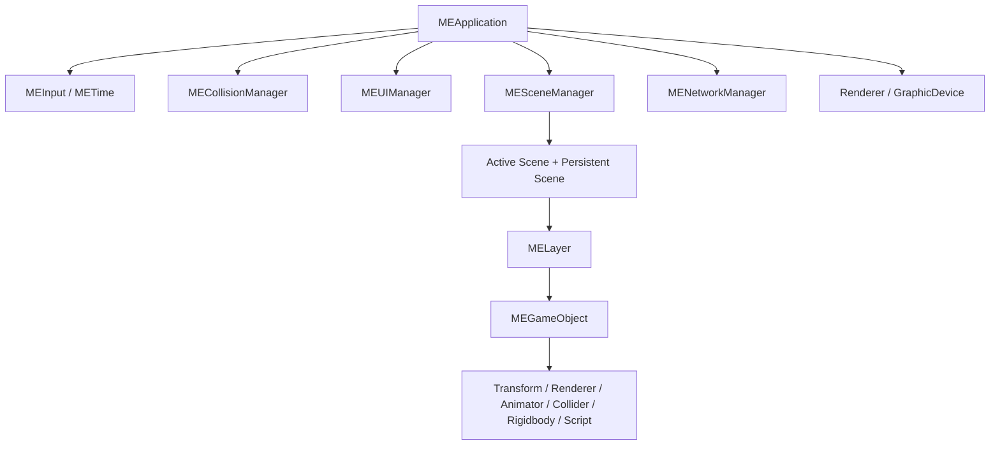

# MyEngine_Source — Engine Core Map

`MyEngine_Source`는 Client가 사용하는 공통 Engine Core와 일부 Server 재사용 코드를 모아 둔 Shared Items 프로젝트입니다.  
GitHub에서는 실제 파일이 평평하게 보이지만, 아래 표는 Visual Studio Filter와 런타임 책임을 기준으로 핵심 파일만 다시 분류한 지도입니다.

[전체 Reviewer Guide로 이동](../docs/REVIEW_GUIDE.md)

## 가장 먼저 볼 파일

| 순서 | 파일 | 확인할 내용 |
|---:|---|---|
| 1 | [`MEApplication.cpp`](./MEApplication.cpp) | Initialize → Update → LateUpdate → Render → Destroy, Service 호출 순서 |
| 2 | [`MESceneManager.cpp`](./MESceneManager.cpp) | Active Scene 전환과 Persistent Scene 유지 |
| 3 | [`MEGameObject.h`](./MEGameObject.h) | GameObject가 Component를 조합·조회하는 방식 |
| 4 | [`MEGraphicDevice_DX11.cpp`](./MEGraphicDevice_DX11.cpp) | D3D11 Device, Context, SwapChain, Render Target |
| 5 | [`MERenderer.cpp`](./MERenderer.cpp) | Render Pass와 공통 렌더 상태 조율 |
| 6 | [`MECollisionManager.cpp`](./MECollisionManager.cpp) | Layer Matrix, Broad Phase, Enter/Stay/Exit |
| 7 | [`MENetworkManager.cpp`](./MENetworkManager.cpp) | TCP Framing, Recv Thread, Packet Queue |
| 8 | [`FSMBrainCore.cpp`](./FSMBrainCore.cpp) | JSON 기반 FSM Runtime과 상태 전이 |

## 런타임 중심 구조



## 1. Core와 Frame Lifecycle

| 책임 | 핵심 파일 | 역할 |
|---|---|---|
| 프레임 조율 | [`MEApplication.cpp`](./MEApplication.cpp) | Engine Service 초기화, Update/Render 순서, Release |
| 시간 | [`METime.cpp`](./METime.cpp) | Delta Time과 시간 갱신 |
| 입력 | [`MEInput.cpp`](./MEInput.cpp) | 키·마우스 상태 갱신 |
| 공통 객체 | [`MEObject.h`](./MEObject.h), [`MEEntity.h`](./MEEntity.h) | 엔진 객체 기반 타입과 ID |
| 수학 | [`MEMath.h`](./MEMath.h) | Vector/Matrix 및 수학 보조 기능 |

## 2. Scene · Layer · GameObject · Component

| 책임 | 핵심 파일 | 역할 |
|---|---|---|
| Scene 전환 | [`MESceneManager.cpp`](./MESceneManager.cpp) | Active/Persistent Scene 소유와 전환 |
| Scene 수명주기 | [`MEScenes.cpp`](./MEScenes.cpp) | Layer별 Update/LateUpdate/Render/Destroy |
| Layer | [`MELayer.cpp`](./MELayer.cpp) | GameObject 분류와 수명주기 전달 |
| GameObject | [`MEGameObject.h`](./MEGameObject.h) | Component 조합과 조회 |
| Component 계약 | [`MEComponent.h`](./MEComponent.h) | Component 공통 기반 |
| Transform/Script | [`METransform.cpp`](./METransform.cpp), [`MEScript.h`](./MEScript.h) | 공간 상태와 게임 로직 확장점 |

```text
SceneManager
├─ Active Scene
└─ Persistent Scene
     ↓
   Layer
     ↓
 GameObject
     ↓
 Component
```

## 3. DirectX 11 Graphics와 Rendering

| 책임 | 핵심 파일 | 역할 |
|---|---|---|
| Graphics Device | [`MEGraphicDevice_DX11.cpp`](./MEGraphicDevice_DX11.cpp) | Device/Context/SwapChain, Render Target, Viewport |
| Render 조율 | [`MERenderer.cpp`](./MERenderer.cpp) | 렌더 상태와 Pass 처리 |
| Shader | [`MEShader.cpp`](./MEShader.cpp) | Shader 생성과 Bind |
| GPU Buffer | [`MEVertexBuffer.cpp`](./MEVertexBuffer.cpp), [`MEIndexBuffer.cpp`](./MEIndexBuffer.cpp), [`MEConstantBuffer.cpp`](./MEConstantBuffer.cpp) | Vertex/Index/Constant Buffer Wrapper |
| Input Layout | [`MEInputLayout.cpp`](./MEInputLayout.cpp) | Vertex 입력 구조와 Shader 연결 |
| Culling | [`MEFrustumCulling.cpp`](./MEFrustumCulling.cpp) | Camera Frustum 기반 가시성 판정 |

HLSL 구현은 [`../Shaders_SOURCE/README.md`](../Shaders_SOURCE/README.md)에 정리되어 있습니다.

## 4. Resource · Model · Material

| 책임 | 핵심 파일 | 역할 |
|---|---|---|
| Resource Cache | [`MEResources.h`](./MEResources.h) | 타입별 Resource 등록·조회 |
| Model Import | [`MEModel.cpp`](./MEModel.cpp) | Model, Mesh, Material 데이터 구성 |
| Mesh | [`MEMesh.cpp`](./MEMesh.cpp) | Geometry와 Buffer 연결 |
| Material | [`MEMaterial.cpp`](./MEMaterial.cpp) | Shader/Texture/Material Parameter |
| Texture | [`METexture.cpp`](./METexture.cpp) | Texture Resource 생성과 Bind |

Resource 목록은 [`../Resources/ResourceList.json`](../Resources/ResourceList.json)에서 확인할 수 있습니다.

## 5. Skeleton과 Animation

| 책임 | 핵심 파일 | 역할 |
|---|---|---|
| Bone 이름 대응 | [`BoneMapManager.h`](./BoneMapManager.h) | 모델별 Bone Name 매핑 |
| Skeleton | [`MESkeleton.cpp`](./MESkeleton.cpp) | Bone 계층과 Skinning 데이터 |
| Animation Clip | [`MEAnimation3D.cpp`](./MEAnimation3D.cpp) | 3D Animation 데이터와 Sampling |
| Animator | [`MEAnimator3D.cpp`](./MEAnimator3D.cpp) | 상태 전환, 재생 시간, Animation Event |
| Renderer Component | [`MEModelRenderer.cpp`](./MEModelRenderer.cpp) | Model과 Rendering Component 연결 |

Bone 매핑 데이터는 [`../Resources/BoneMap.json`](../Resources/BoneMap.json)에 있습니다.

## 6. Collision과 Spatial Query

| 책임 | 핵심 파일 | 역할 |
|---|---|---|
| 충돌 조율 | [`MECollisionManager.cpp`](./MECollisionManager.cpp) | Layer Matrix, Pair 상태, Enter/Stay/Exit |
| Broad Phase | [`MEQuadTree.cpp`](./MEQuadTree.cpp) | 공간 후보 축소 |
| Collider 계약 | [`MECollider.h`](./MECollider.h) | Collider 공통 인터페이스 |
| 3D Collider | [`MEBoxCollider3D.cpp`](./MEBoxCollider3D.cpp) | Box Collider 검사 |
| 물리 이동 | [`MERigidbody.cpp`](./MERigidbody.cpp) | Force/Velocity 기반 위치 갱신 |

Server의 단순화된 Sweep 판정은 [`../GameServer/ServerMath.cpp`](../GameServer/ServerMath.cpp)와 [`../GameServer/ServerCombatSystem.cpp`](../GameServer/ServerCombatSystem.cpp)에서 별도로 처리합니다.

## 7. Client Networking

| 책임 | 핵심 파일 | 역할 |
|---|---|---|
| 공통 Protocol | [`Protocol.h`](./Protocol.h) | Packet Header, C_/S_ Packet, EntityId/ProjectileId |
| Client Socket | [`MENetworkManager.cpp`](./MENetworkManager.cpp) | Connect, SendAll, Recv Thread, Stream Framing |
| Main Thread Dispatch | [`MEClientPacketHandler.cpp`](./MEClientPacketHandler.cpp) | S_* Packet을 Scene/Presentation 상태에 반영 |

```text
Recv Thread
→ pendingBuffer
→ PacketHeader.size 기준 Packet 분리
→ Packet Queue
→ NetworkManager::Update
→ ClientPacketHandler
→ Scene / Remote Object / UI
```

Server 측 대응 구현은 [`../GameServer/README.md`](../GameServer/README.md)를 참고합니다.

## 8. Shared FSM Core

| 책임 | 핵심 파일 | 역할 |
|---|---|---|
| Runtime Core | [`FSMBrainCore.cpp`](./FSMBrainCore.cpp) | State 실행과 Decision 기반 전이 |
| Factory | [`FSMFactory.h`](./FSMFactory.h) | JSON 정의에서 State/Task/Decision 생성 |
| Context 경계 | [`IFSMContext.h`](./IFSMContext.h) | Runtime이 Client/Server 구현에 직접 결합되지 않도록 추상화 |
| Client Context | [`MEClientFSMContext.cpp`](./MEClientFSMContext.cpp) | Transform/Animator/Scene 기반 동작 |
| FSM Component | [`MEFSMBrain.cpp`](./MEFSMBrain.cpp) | GameObject에 연결되는 Runtime Component |

Server Context는 [`../GameServer/MEServerMonsterFSMContext.cpp`](../GameServer/MEServerMonsterFSMContext.cpp)에서 확인할 수 있습니다.

## 전체 파일을 읽어야 하는가?

아닙니다. 처음 검토할 때는 다음 8개만 읽어도 구조를 충분히 파악할 수 있습니다.

```text
MEApplication.cpp
MESceneManager.cpp
MEGameObject.h
MEGraphicDevice_DX11.cpp
MERenderer.cpp
MECollisionManager.cpp
MENetworkManager.cpp
FSMBrainCore.cpp
```
