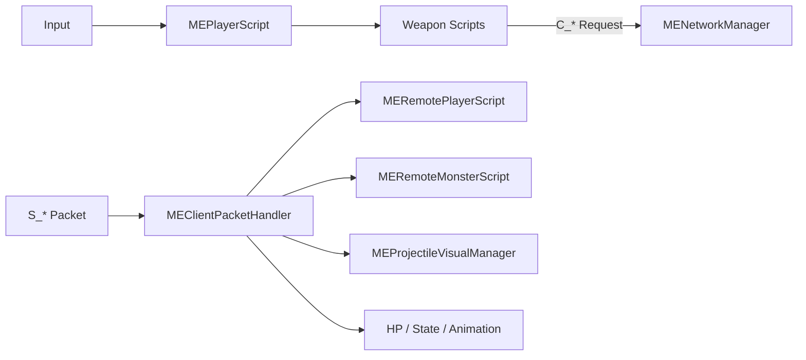

# MyEngine_W — Client Gameplay & Presentation Map

`MyEngine_W`는 Engine Core 위에서 실행되는 Client Gameplay와 Presentation 코드입니다.  
로컬 입력·무기 요청, Scene 구성, 서버가 보낸 원격 Player/Monster/Projectile 결과의 시각화를 담당합니다.

[전체 Reviewer Guide로 이동](../docs/REVIEW_GUIDE.md) · [Engine Core 보기](../MyEngine_Source/README.md) · [Server 보기](../GameServer/README.md)

## 가장 먼저 볼 파일

| 순서 | 파일 | 확인할 내용 |
|---:|---|---|
| 1 | [`MEPlayerScript.cpp`](./MEPlayerScript.cpp) | 로컬 Player 입력, 상태, 무기 교체 |
| 2 | [`MEWeaponScript.h`](./MEWeaponScript.h) | 무기 공통 계약과 Animation Event 연결 |
| 3 | [`MEGunScript.cpp`](./MEGunScript.cpp) | 총기 공격 요청과 시각 표현 |
| 4 | [`MESwordScript.cpp`](./MESwordScript.cpp) | 근접 콤보와 공격 구간 |
| 5 | [`MERemotePlayerScript.cpp`](./MERemotePlayerScript.cpp) | 서버 결과 기반 원격 Player 표현 |
| 6 | [`MERemoteMonsterScript.cpp`](./MERemoteMonsterScript.cpp) | 원격 Monster 이동·상태·공격 표현 |
| 7 | [`MEProjectileVisualManager.cpp`](./MEProjectileVisualManager.cpp) | ProjectileId 기반 시각 투사체 수명 관리 |

## Client 역할 경계



- Client는 입력을 수집하고 행동을 요청합니다.
- 서버가 확정한 이동·상태·공격·피해 결과를 표현합니다.
- 서버 투사체는 `ProjectileId`를 사용해 Client 시각 오브젝트와 연결합니다.
- Client Scene의 실제 변경은 Recv Thread가 아니라 Main Thread의 Packet Handler에서 수행됩니다.

## 1. Local Player와 Camera

| 파일 | 역할 |
|---|---|
| [`MEPlayerScript.cpp`](./MEPlayerScript.cpp) | 입력, 이동, 상태 변경, 무기 교체, 공격 요청 |
| [`MEActorScript.cpp`](./MEActorScript.cpp) | HP·피격·사망 등 Actor 공통 로직 |
| [`MECameraScript.cpp`](./MECameraScript.cpp) | Player 추적 Camera |
| [`MEPlayer.h`](./MEPlayer.h) | Player Object 타입 |

## 2. Weapon과 Combat Presentation

| 파일 | 역할 |
|---|---|
| [`MEWeaponScript.h`](./MEWeaponScript.h) | 무기 공통 상태와 Animation Event 계약 |
| [`MEGunScript.cpp`](./MEGunScript.cpp) | 총기 공격 요청, 총구·방향 데이터 |
| [`MESwordScript.cpp`](./MESwordScript.cpp) | 검 콤보와 타격 구간 |
| [`MEGauntletScript.cpp`](./MEGauntletScript.cpp) | 건틀릿 무기 표현 |
| [`MEBulletScript.cpp`](./MEBulletScript.cpp) | 로컬/기존 투사체 동작 예시 |

전투의 최종 충돌과 HP 변경은 [`../GameServer/ServerCombatSystem.cpp`](../GameServer/ServerCombatSystem.cpp)에서 처리합니다.

## 3. Server Result Presentation

| 파일 | 역할 |
|---|---|
| [`MERemotePlayerScript.cpp`](./MERemotePlayerScript.cpp) | EntityId별 원격 Player 위치·회전·상태 표현 |
| [`MERemoteMonsterScript.cpp`](./MERemoteMonsterScript.cpp) | Monster State와 Animation 표현 |
| [`MENetworkProjectileScript.cpp`](./MENetworkProjectileScript.cpp) | 서버 투사체의 Client 측 시각 상태 |
| [`MEProjectileVisualManager.cpp`](./MEProjectileVisualManager.cpp) | ProjectileId 등록, 갱신, 제거 |

수신 패킷의 타입 분기와 Scene 적용 시작점은 [`../MyEngine_Source/MEClientPacketHandler.cpp`](../MyEngine_Source/MEClientPacketHandler.cpp)입니다.

## 4. Scene 구성

| 파일 | 역할 |
|---|---|
| [`METitleScene.cpp`](./METitleScene.cpp) | Title Scene 구성 |
| [`MELoadingScene.cpp`](./MELoadingScene.cpp) | Resource Loading Scene |
| [`MEPlayScene.cpp`](./MEPlayScene.cpp) | 실제 Gameplay Scene 구성 |
| [`MELoadScene.h`](./MELoadScene.h) | Scene 생성·등록 진입점 |

## 5. FSM Task와 Decision 예시

이 폴더의 일부 Task/Decision은 Engine에 종속되지 않는 행동 단위로 작성되어 Server에서도 재사용됩니다.

| 분류 | 대표 파일 |
|---|---|
| Task | [`MEMoveToTargetTask.cpp`](./MEMoveToTargetTask.cpp), [`MERandomWanderTask.cpp`](./MERandomWanderTask.cpp), [`MEMeleeAttackTask.cpp`](./MEMeleeAttackTask.cpp), [`MEPlayAnimTask.cpp`](./MEPlayAnimTask.cpp) |
| Decision | [`MEDetectTargetDecision.cpp`](./MEDetectTargetDecision.cpp), [`MEDistanceDecision.cpp`](./MEDistanceDecision.cpp), [`METimerDecision.cpp`](./METimerDecision.cpp), [`MEAnimFinishDecision.cpp`](./MEAnimFinishDecision.cpp) |
| 종료 | [`MEDestroyTask.cpp`](./MEDestroyTask.cpp) |

공통 실행 Core는 [`../MyEngine_Source/FSMBrainCore.cpp`](../MyEngine_Source/FSMBrainCore.cpp), Server 연결은 [`../GameServer/MEServerMonsterFSMContext.cpp`](../GameServer/MEServerMonsterFSMContext.cpp)에서 확인할 수 있습니다.

## 추천 흐름 두 개만 읽기

### 로컬 공격 요청

```text
MEPlayerScript
→ 현재 Weapon Script
→ C_ATTACK Packet
→ MENetworkManager::Send
→ ServerCombatSystem
```

### 서버 결과 표현

```text
MENetworkManager Recv Thread
→ Packet Queue
→ MEClientPacketHandler
→ RemotePlayer / RemoteMonster / ProjectileVisualManager
```
